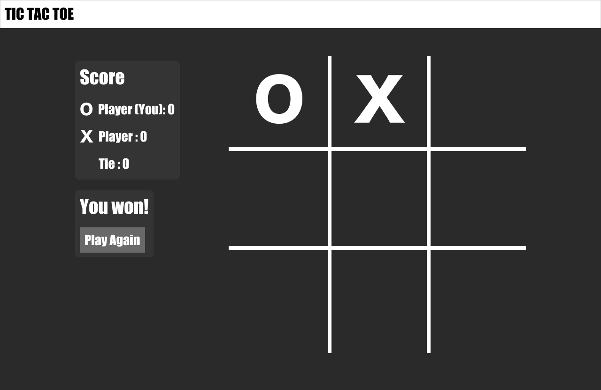
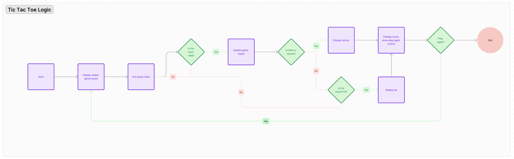

# TIC TAC TOE
A simple game of tic tac toe.

## :computer: [Click here](https://angelatolim.github.io/tictactoe/) to see my live project!

## :page_facing_up: About
- You can play two player tic tac toe by clicking on the grid.  The counter will keep score and you can reset the game with the play again button.
- Download instructions (if relevant):
```zsh
$ git clone my-awesome-app
$ cd my-awesome-app
$ node app.js
```


## :pencil2: Planning & Problem Solving
- Inspiration taken from existing websites
- Design of initial wireframe created in Figma

- Flow charts of logic



## :rocket: Cool tech
- HTML
- CSS
- Javascript

## :scream: Bugs to fix :poop:
- Game continues to play after winner is determined
- Align score for "tie" with the other players
- If you play the game too many times the green background won't reset and the same character appears more than once


## :sob: Lessons learnt
- Start off with doing the images rather than replacing X and O with images
- Maybe add images rather than show/hide images

## :white_check_mark: Future features
- Would like to try animations or work in more game logic